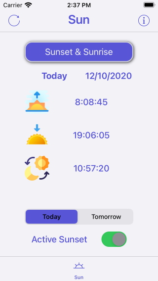
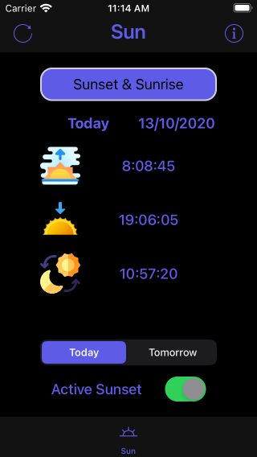

# SunsetApp

  

### Fonctionnalités :

Application with a free API that provides sunset and sunrise times for a given latitude and longitude.

https://sunrise-sunset.org/api

| Sun - Light mode | Sun - Dark mode |
| -------- | ------------- |
| | |

---
#### Credits :
Icons made by Freepik : [Freepik](https://www.flaticon.com/authors/freepik) from Flaticon : [Flaticon](https://www.flaticon.com)
API SunriseSunset : [sunrise-sunset.org](https://sunrise-sunset.org/api)
Gif créé avec : [makeagif.com](https://makeagif.com)
