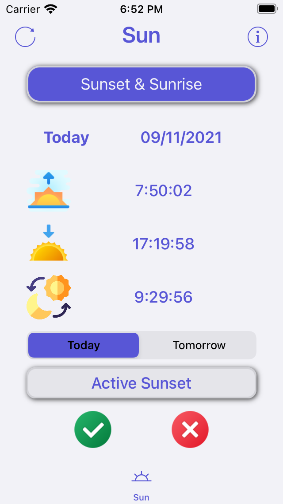
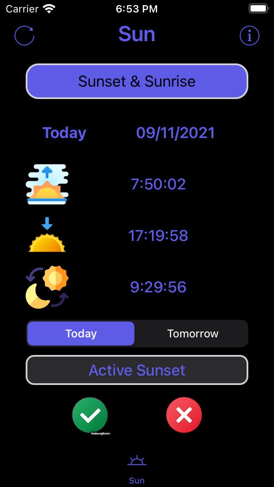

# SunsetApp

  

### Fonctionnalités :

Application with a free API that provides sunset and sunrise times for a given latitude and longitude.

https://sunrise-sunset.org/api

| Sun - Light mode | Sun - Dark mode |
| -------- | ------------- |
| | |

